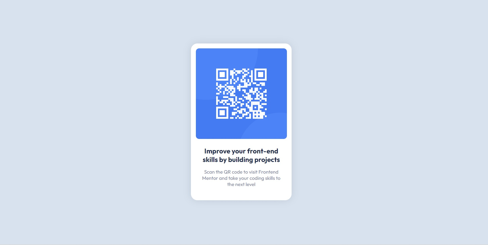

# Frontend Mentor - QR code component solution

This is a solution to the [QR code component challenge on Frontend Mentor](https://www.frontendmentor.io/challenges/qr-code-component-iux_sIO_H). Frontend Mentor challenges help you improve your coding skills by building realistic projects. 

## Table of contents

- [Overview](#overview)
  - [Screenshot](#screenshot)
  - [Links](#links)
- [My process](#my-process)
  - [Built with](#built-with)
- [Author](#author)

## Overview

### Screenshot

### Links

- Solution URL: [GitHub](https://github.com/sevvy-thewebcoder/qr-code-component)
- Live Site URL: [QR-Code-Component](https://sevvy-thewebcoder.github.io/qr-code-component/)

## My process

### Built with

- Semantic HTML5 markup
- CSS custom properties
- CSS Flex-box
- Mobile-first workflow

## Author

- LinkedIn - [@webcodersevvy](https://www.linkedin.com/in/webcodersevvy/)
- Instagram - [@webcodersevvy](https://www.instagram.com/webcodersevvy/)
- Frontend Mentor - [@sevvy-thewebcoder](https://www.frontendmentor.io/profile/sevvy-thewebcoder)
- Twitter - [@webcodersevvy](https://www.twitter.com/webcodersevvy)